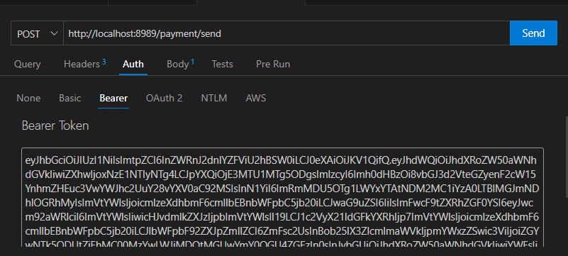

# Delos BE-Assignment

I've built this app using GoLang. PostgreSQL is utilized for data storage, hosted externally. Authentication is managed through Supabase, and Swagger is employed for API documentation.

This is a brief guide on how to install and use the app. You can see the link to API Documentation at the bottom of this readme.

## Architecture

The application follows a layered architecture consisting of four main components:

- **Controller:** Manages HTTP requests and responses, and acts as the entry point for API interactions.
- **Service:** Contains business logic and coordinates the interaction between the controller and the data access layer.
- **DAO (Data Access Object):** Handles direct database operations and queries, ensuring a clean separation between the business logic and database.
- **DTO (Data Transfer Object):** Defines the structure of the data exchanged between the different layers of the application.

This architecture promotes a clear separation of concerns and enhances the maintainability and scalability of the application.

## Environment

- Use Golang version 1.19

## Installation

To install this DELOS BE-ASSIGNMENT, follow these steps:

1. Clone the repository:

    ```bash
    git clone https://github.com/azrielrisywan/delos-be-assignment.git
    ```

2. Navigate to the project directory:

    ```bash
    cd delos-be-assignment
    ```

3. Install dependencies:

    ```bash
    go mod tidy
    ```

4. Run the project:

    ```bash
    go run main.go
    ```

   **Note:** No need to run any command for the storage system because it is already hosted.

## Sign In & Sign Up

Before using the main features of the app, you need to sign up and sign in to obtain an access token. This token will be attached to every endpoint request.

### Sign Up

- **Endpoint:** `localhost:8888/signup`
- Sign up with your active email. An activation link will be sent to your email after sign up. [Test with Swagger](http://localhost:8989/swagger/index.html)*

### Sign In

- **Endpoint:** `localhost:8888/signin`
- You can sign in with the following credentials:
  - Email: `risywanazriel@gmail.com`
  - Password: `123456`
- Or use your own email and password if you have signed up. [Test with Swagger](http://localhost:8989/swagger/index.html)*

## Main Features

Attach `access_token` to these endpoint headers, for example:


- ## FARMS

### Farm List

- **Endpoint:** `GET localhost:8989/farm/list`
- Requests a list of all existing farms. Returns 404 Not Found if no entity is found. [Test with Swagger](http://localhost:8989/swagger/index.html)*

### Farm List By ID

- **Endpoint:** `GET localhost:8989/farm/list/{id}`
- Requests a specific farm by using its ID in the path parameter. Returns 404 Not Found if no entity is found. [Test with Swagger](http://localhost:8989/swagger/index.html)*

### Create Farm

- **Endpoint:** `POST localhost:8989/farm/create`
- Requests to create a farm. Duplicate entries will be denied. [Test with Swagger](http://localhost:8989/swagger/index.html)*

### Update Farm

- **Endpoint:** `PUT localhost:8989/farm/update`
- Requests to update an existing farm or create one if the entity specified in the payload doesn't exist. [Test with Swagger](http://localhost:8989/swagger/index.html)*

### Delete Farm

- **Endpoint:** `DELETE localhost:8989/farm/delete/{id}`
- Deletes an existing farm using a soft delete approach so the data is not completely removed from the database. Returns an error if the specified farm doesn't exist. [Test with Swagger](http://localhost:8989/swagger/index.html)*

- ## PONDS

### Pond List

- **Endpoint:** `GET localhost:8989/pond/list`
- Requests a list of all existing ponds. Returns 404 Not Found if no entity is found. [Test with Swagger](http://localhost:8989/swagger/index.html)*

### Pond List By ID

- **Endpoint:** `GET localhost:8989/pond/list/{id}`
- Requests a specific pond by using its ID in the path parameter. Returns 404 Not Found if no entity is found. [Test with Swagger](http://localhost:8989/swagger/index.html)*

### Create Pond

- **Endpoint:** `POST localhost:8989/pond/create`
- Requests to create a pond. Duplicate entries will be denied. [Test with Swagger](http://localhost:8989/swagger/index.html)*

### Update Pond

- **Endpoint:** `PUT localhost:8989/pond/update`
- Requests to update an existing pond or create one if the entity specified in the payload doesn't exist. [Test with Swagger](http://localhost:8989/swagger/index.html)*

### Delete Pond

- **Endpoint:** `DELETE localhost:8989/pond/delete/{id}`
- Deletes an existing pond using a soft delete approach so the data is not completely removed from the database. Returns an error if the specified pond doesn't exist. [Test with Swagger](http://localhost:8989/swagger/index.html)*

- ## Endpoint Stats

### Retrieve Stats

- **Endpoint:** `GET localhost:8989/stats`
- Counts how many times each endpoint is called. [Test with Swagger](http://localhost:8989/swagger/index.html)*

# Swagger Docs

Link : http://localhost:8989/swagger/index.html 
*(run the app first).
